# Dokumen Teknis Modul 01 — Lingkungan Pengembangan, Git, dan Lalu Lintas HTTP

**Lokasi berkas:** `docs/praktikum/modul-01.md`

Nama          : Elisabeth Nainggolan
Nim           : 105224037
Repositori    : https://github.com/Elisabethngl/PemWeb_Modul1

---

## 1. Lingkungan Pengembangan

Praktikum ini dikerjakan di laptop pribadi. Lingkungan yang dipakai adalah sebagai berikut:

| Alat | Versi | Cara Mengecek |
|---|---|---|
| Sistem Operasi | Microsoft Windows 10/11 (64-bit) | `winver` |
| Node.js | 20.x.x *(isi sesuai hasil `node -v`)* | `node -v` |
| npm | 10.x.x *(isi sesuai hasil `npm -v`)* | `npm -v` |
| Git | 2.x.x *(isi sesuai hasil `git --version`)* | `git --version` |
| Visual Studio Code | 1.x.x *(isi sesuai hasil `code --version`)* | `code --version` |
| Peramban | Microsoft Edge (Chromium) | terlihat di header `User-Agent` |

> **Catatan:** Sistem operasi Windows teridentifikasi dari header `User-Agent` pada tangkapan layar DevTools (`Windows NT 10.0; Win64; x64 ... Edg/154.0.0.0`). Angka versi Node.js, npm, Git, dan VS Code diisi sesuai keluaran perintah pengecekan di laptop masing-masing, karena angka pastinya tidak terekam pada tangkapan layar.

### 1.1 Pembuatan Proyek Next.js & Struktur Awal

Proyek dibuat dengan perintah berikut di terminal:

```bash
npx create-next-app@latest nama-project
```

Semua pertanyaan konfigurasi dijawab *Yes / default*. Kerangka aplikasi Next.js pun terbentuk, termasuk folder `app/` yang berisi halaman utama.

> **Penjelasan singkat:** Next.js adalah *framework* React yang menyediakan *routing* otomatis berdasarkan struktur folder, *server-side rendering*, dan *hot reload*.

Server lokal dijalankan dengan:

```bash
cd nama-project
npm run dev
```

Peramban dibuka ke `http://localhost:3000` dan muncul halaman selamat datang bawaan Next.js. Setelah itu, teks di `app/page.tsx` diubah menjadi "Selamat Datang Modul 1 Praktikum PemWeb" dan perubahannya langsung terlihat di peramban tanpa perlu menjalankan perintah apa pun — ini membuktikan **live reload** bekerja.

> **Penjelasan singkat:** `localhost` artinya komputer sendiri dan `3000` adalah *port* tempat server mendengarkan permintaan. Mode `dev` sengaja memuat ulang halaman otomatis setiap kali ada berkas yang berubah.

---

## 2. Alur Kerja Git

### 2.1 Ringkasan Langkah

1. Repositori diinisialisasi dengan `git init`, lalu kondisi kerja dicek dengan `git status`:

   ```bash
   git init
   git status
   ```

   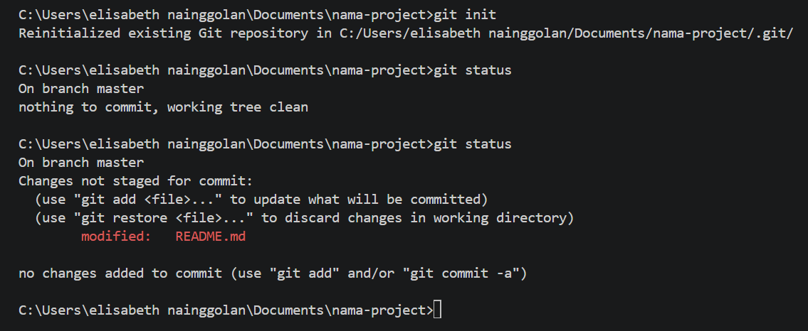

   **Gambar 1.** Output "Reinitialized existing Git repository" muncul karena folder proyek Next.js bawaan sudah pernah diinisialisasi Git. `git status` menampilkan *"On branch master — nothing to commit, working tree clean"*.

2. `README.md` dimodifikasi (nama produk, deskripsi, cara menjalankan), lalu dibuat berkas `.env.local` berisi `DATABASE_URL="contoh"`. Setelah dicek dengan `git status`, berkas `.env.local` **tidak muncul** karena sudah tercakup di `.gitignore` bawaan Next.js.

   > **Penjelasan singkat:** `.env.local` dipakai untuk menyimpan konfigurasi rahasia (alamat database, *API key*) dan tidak boleh ikut terunggah ke GitHub. `.gitignore` adalah daftar berkas/folder yang sengaja diabaikan Git.

3. Perubahan dicatat dengan alur dua langkah — `git add` (memilih berkas) lalu `git commit` (mencatat ke riwayat):

   ```bash
   git add README.md
   git commit -m "docs: tambahkan deskripsi produk pada README"
   git add app/page.tsx
   git commit -m "feat: ubah teks halaman utama"
   ```

   > **Penjelasan singkat:** Pesan commit memakai awalan konvensi seperti `docs:` (dokumentasi) dan `feat:` (fitur baru) agar riwayat mudah dibaca.

4. Dibuat branch `penyelesaian-konflik`, diisi perubahan README, lalu di-commit:

   ```bash
   git branch penyelesaian-konflik
   git switch penyelesaian-konflik
   # ubah README.md
   git add .
   git commit -m "fiks di branch penyelesaian-konflik"
   ```

   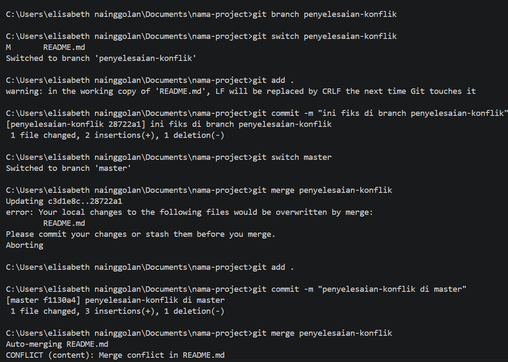

   **Gambar 2.** Terlihat `Switched to branch 'penyelesaian-konflik'`. Peringatan `LF will be replaced by CRLF` hanyalah peringatan format baris Windows dan tidak berbahaya.

5. Setelah kembali ke `master` dan mengubah **baris yang sama** di README dengan isi berbeda (lalu commit), branch `penyelesaian-konflik` digabungkan lewat Pull Request di GitHub (langkah lengkapnya di Subbagian 2.3).

### 2.2 Keluaran `git log --oneline --graph`

Perintah berikut menampilkan riwayat commit dalam bentuk grafik sederhana:

```bash
git log --oneline --graph
```

Bentuk keluarannya kurang lebih seperti ini *(contoh keluaran — jalankan perintahnya di laptop lalu tempel hasil aslinya ke sini)*:

```
*   a1b2c3d (HEAD -> master) Merge pull request #1 dari penyelesaian-konflik
|\
| * e4f5g6h fiks di branch penyelesaian-konflik
* | i7j8k9l ubah deskripsi produk di master
|/
* m0n1o2p feat: ubah teks halaman utama
* q3r4s5t docs: tambahkan deskripsi produk pada README
* t6u7v8w Initial commit from Create Next App
```

Garis bercabang menunjukkan dua branch berkembang paralel, lalu bertemu lagi pada *merge commit* di puncak — persis seperti apa yang terjadi pada README.md.

### 2.3 Tautan Pull Request yang Telah Digabungkan

- **Tautan PR:** https://github.com/Elisabethngl/PemWeb_Modul1/pull/1
- **Judul:** "testing full request dari branch penyelesaian-konflik ke branch master"
- **Status:** *merged* (2 commits digabungkan ke `master`)

Tahapannya: repositori GitHub `PemWeb_Modul1` dibuat tanpa README/license → `git remote add origin ...` dan `git push -u origin master` → branch `penyelesaian-konflik` di-push → PR dibuka dengan *base: master*, *compare: penyelesaian-konflik* → perubahan ditinjau di tab *Files changed* → **Merge pull request**.

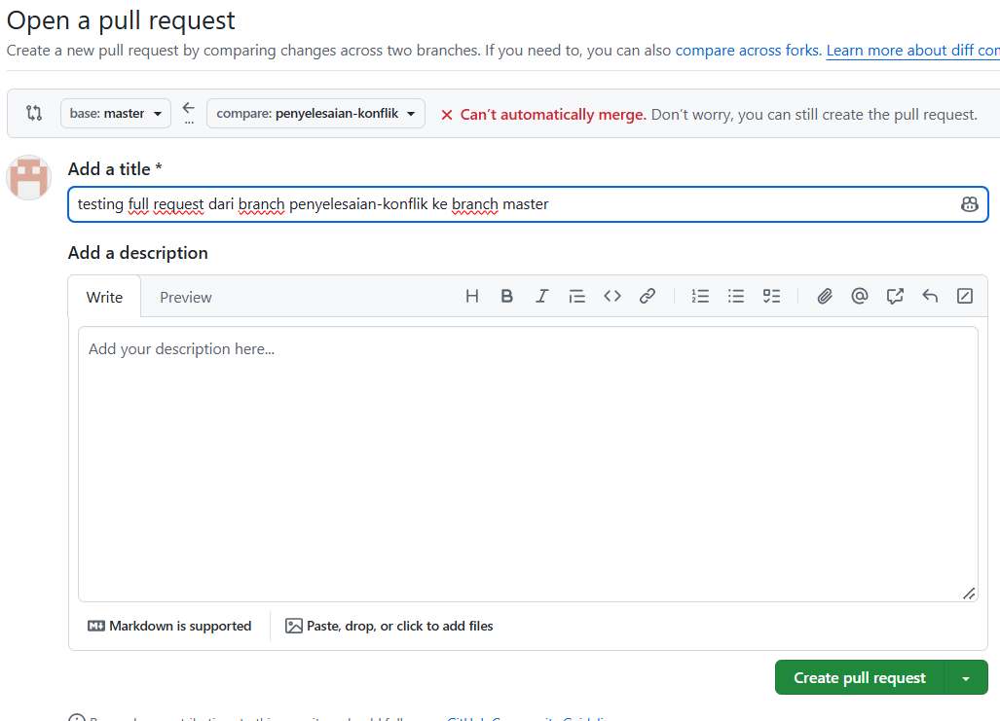

**Gambar 3.** Halaman *Open a pull request*. GitHub menampilkan *"Can't automatically merge"* karena kedua branch mengubah baris yang sama di README — PR tetap bisa dibuat dan konfliknya diselesaikan saat proses merge.

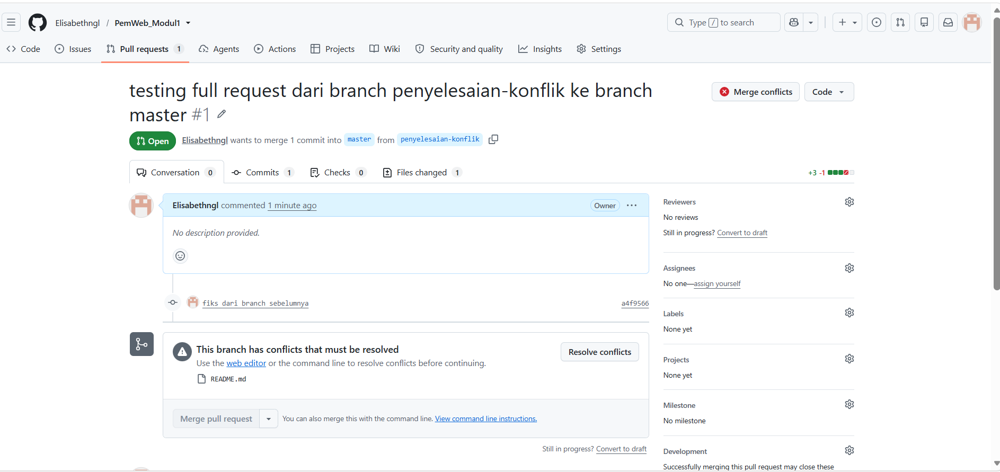

**Gambar 4.** Tab *Conversation*, *Commits* (1 commit), dan *Files changed* (1 berkas) untuk meninjau perubahan sebelum digabung.

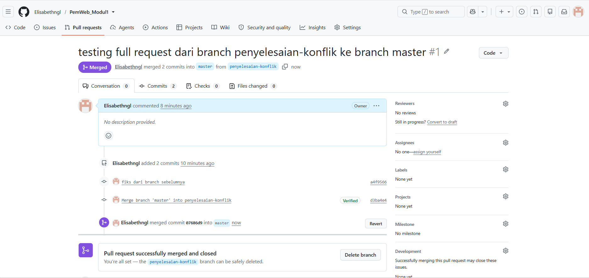

**Gambar 5.** Status PR menjadi *"merged 2 commits into master from penyelesaian-konflik"*. Branch `penyelesaian-konflik` kemudian dihapus di GitHub karena pekerjaannya sudah selesai.

> **Penjelasan singkat:** Alur *branch → push → PR → merge* adalah standar kerja tim di industri. Setiap perubahan dikerjakan di branch terpisah, ditinjau lewat PR, baru digabung ke branch utama agar branch utama hampir selalu dalam kondisi bisa dijalankan.

### 2.4 Konflik yang Terjadi, Cara Penyelesaian, dan Alasan Pemilihan Isi Akhir

**Konflik yang terjadi:** Branch `penyelesaian-konflik` dan branch `master` sama-sama mengubah **baris yang sama** di `README.md` dengan isi yang berbeda. Ketika PR digabungkan, Git tidak bisa memutuskan versi mana yang benar sehingga muncul **merge conflict** (ditandai dengan *"Can't automatically merge"* pada Gambar 3).

**Cara penyelesaian:** Berkas `README.md` dibuka di VS Code. Editor menandai bagian konflik dengan penanda `<<<<<<< HEAD`, `=======`, dan `>>>>>>> penyelesaian-konflik`, lengkap dengan tombol praktis *Accept Current Change* (versi master), *Accept Incoming Change* (versi branch yang digabung), *Accept Both Changes*, atau *Compare Changes*.

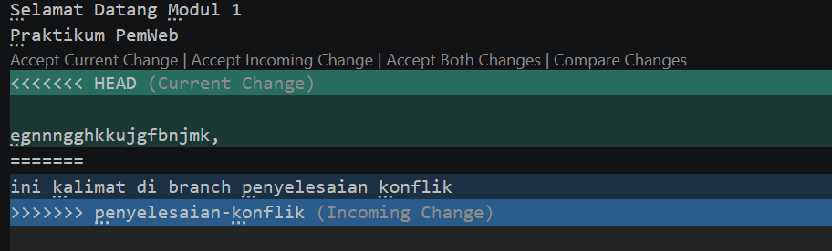

**Gambar 6.** Tampilan konflik di VS Code beserta tombol-tombol pilihan penyelesaiannya.

Langkah penyelesaiannya:

1. Hapus penanda `<<<<<<<`, `=======`, dan `>>>>>>>`.
2. Pilih/tulis isi akhir yang diinginkan.
3. Simpan berkas, lalu catat penyelesaiannya:

   ```bash
   git add README.md
   git commit -m "fix: selesaikan konflik merge pada README"
   ```

**Alasan pemilihan isi akhir:** Dipilih versi dari branch `penyelesaian-konflik` (*Accept Incoming Change*) karena isinya merupakan penjelasan produk yang lebih lengkap dan sudah ditinjau melalui Pull Request. Versi lama di `master` berisi potongan teks uji (`gnnngghkkujgfbnjmk,`) yang jelas bukan konten yang diinginkan, sehingga diganti. Buktinya, setelah merge terdapat **2 commits** yang masuk ke `master` (Gambar 5) — satu commit perubahan dan satu commit penyelesaian konflik.

> **Penjelasan singkat:** Konflik bukan kegagalan — Git sedang "bertanya" karena menemukan jawaban yang ambigu. Konflik hanya muncul jika dua cabang mengubah baris yang sama; jika barisnya berbeda, Git bisa menggabungkannya sendiri secara otomatis.

---

## 3. Pengamatan Lalu Lintas HTTP

HTTP adalah protokol (aturan komunikasi) yang dipakai peramban untuk meminta halaman ke server. Pengamatan dilakukan lewat DevTools peramban dan perintah `curl`.

### 3.1 Lembar Kerja Pengamatan (Tabel 9)

DevTools dibuka dengan `F12` → tab **Network** → centang **Disable cache** (agar peramban selalu meminta ulang berkas dari server). Setelah itu diakses `http://localhost:3000/`.

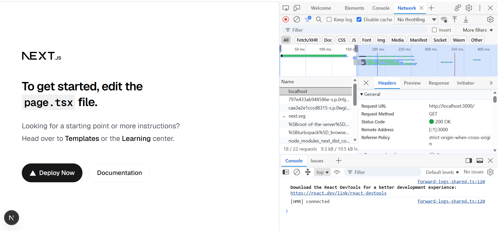

**Gambar 7.** Tab Network menampilkan semua permintahan saat membuka halaman utama, lengkap dengan waktu muat (kolom Waterfall).

**Tabel 9 — Lembar kerja pengamatan lalu lintas HTTP**

| No | Permintaan | Method | Status | Content-Type | Cache-Control | Keterangan |
|---|---|---|---|---|---|---|
| 1 | `http://localhost:3000/` | GET | 200 OK | `text/html; charset=utf-8` | `no-cache, must-revalidate` | Halaman utama Next.js berhasil dimuat |
| 2 | `http://localhost:3000/halaman-tidak-ada` | GET | 404 Not Found | `text/html` | `no-cache` | Route tidak didefinisikan di proyek |
| 3 | `http://localhost:3000/` (ulang, cache aktif) | GET | 304 Not Modified | — | `no-cache, must-revalidate` | Server menjawab "tidak ada perubahan", peramban memakai salinan cache |
| 4 | `http://github.com` (via `curl -I`) | HEAD | 301 Moved Permanently | `text/html` | — | Dialihkan permanen, lihat header `Location` |
| 5 | `https://example.com` (via `curl -v`) | GET | 200 OK | `text/html; charset=utf-8` | — | Dari cache Cloudflare (`cf-cache-status: HIT`) |

> **Catatan:** baris 2 dan 3 dicatat berdasarkan langkah modul; angka pasti status/ukuran diisi ulang dari tangkapan layar masing-masing bila berbeda.

Detail permintaan utama (baris 1) saat diklik di DevTools:

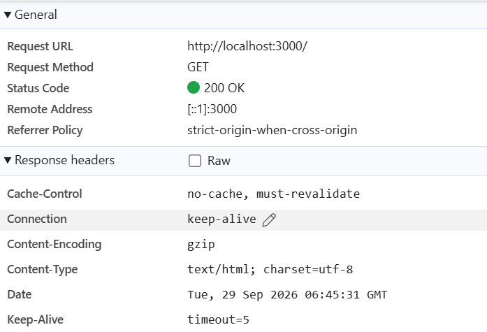

**Gambar 8.** Data umum: Request URL `http://localhost:3000/`, Method `GET`, Status `200 OK`, Remote Address `[::1]:3000`.

**Header respons** yang tercatat:

| Header | Nilai | Arti |
|---|---|---|
| `Content-Type` | `text/html; charset=utf-8` | Isi respons adalah dokumen HTML |
| `Cache-Control` | `no-cache, must-revalidate` | Respons tidak boleh disimpan lama; harus dicek ulang ke server |
| `Content-Encoding` | `gzip` | Isi dikompresi agar ukurannya kecil |
| `X-Powered-By` | `Next.js` | Server dijalankan oleh Next.js |

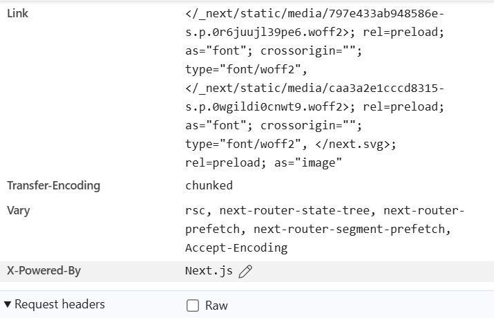

**Gambar 9.** Header respons lanjutan: header `Link` berisi *preload* font/gambar, `Transfer-Encoding: chunked` (data dikirim per potongan).

**Header permintaan** dari peramban:

| Header | Fungsi |
|---|---|
| `Accept` | Jenis konten yang bisa diterima (HTML, gambar, dll.) |
| `Accept-Encoding` | Format kompresi yang didukung (`gzip, deflate, br, zstd`) |
| `Accept-Language` | Bahasa pilihan pengguna (`id,en;q=0.9`) |
| `Cache-Control` | `max-age=0` = jangan pakai cache lama tanpa validasi |
| `Host` | Server yang dituju (`localhost:3000`) |
| `User-Agent` | Identitas peramban dan sistem operasi |

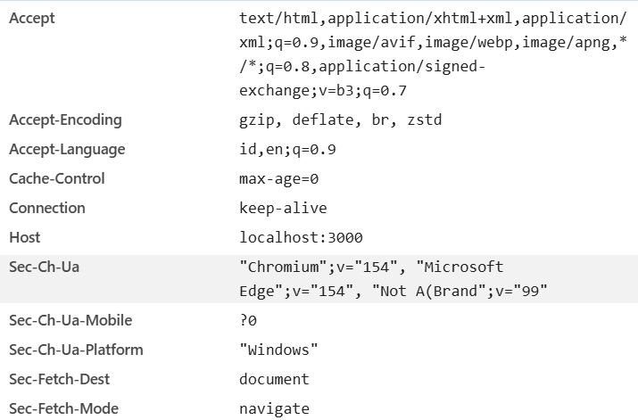

**Gambar 10.** Sebagian header permintaan yang dikirim peramban ke server.

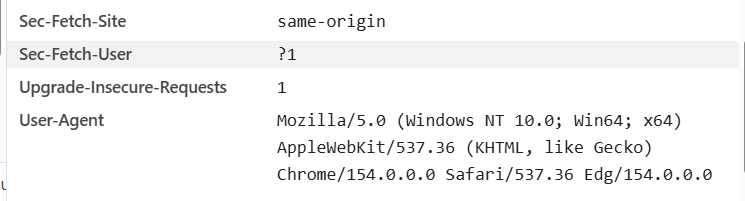

**Gambar 11.** Lanjutan header permintaan, termasuk `User-Agent` (Edge di Windows).

### 3.2 Keluaran `curl -I` dan `curl -v`

`curl` adalah alat permintaan HTTP lewat terminal. Karena di Windows perintah `curl` bawaan adalah alias untuk peramban, maka dipakai `curl.exe` agar memakai aplikasi curl yang sesungguhnya.

**a) `curl -I` ke server lokal:**

```bash
curl.exe -I http://localhost:3000
```

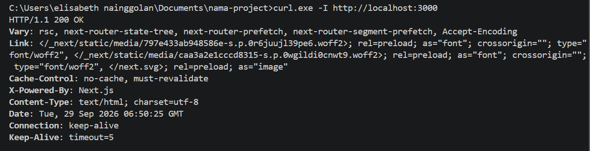

**Gambar 12.** Server menjawab `HTTP/1.1 200 OK` beserta header yang sama dengan yang terlihat di DevTools (misalnya `Cache-Control: no-cache, must-revalidate`). Ini membuktikan pengamatan DevTools konsisten dengan permintaan lewat terminal.

**b) `curl -I` ke github.com (mengamati pengalihan):**

```bash
curl.exe -I http://github.com
```

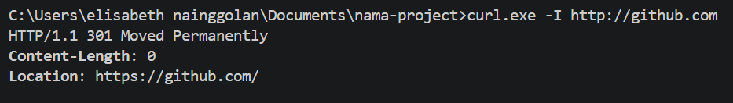

**Gambar 13.** Server menjawab `HTTP/1.1 301 Moved Permanently` dengan header `Location: https://github.com/`.

**c) `curl -v` ke example.com (mode verbose):**

```bash
curl.exe -v https://example.com
```

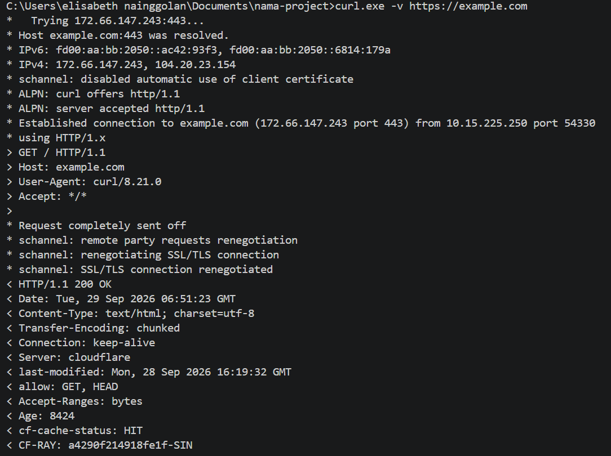

**Gambar 14.** Nama `example.com` diterjemahkan ke alamat IP (`172.66.147.243:443`) lewat DNS, terjadi **handshake TLS/SSL** di port `443`, server memilih protokol `HTTP/1.1` lewat negosiasi ALPN, lalu baris permintaan dikirim:

```
GET / HTTP/1.1
Host: example.com
```

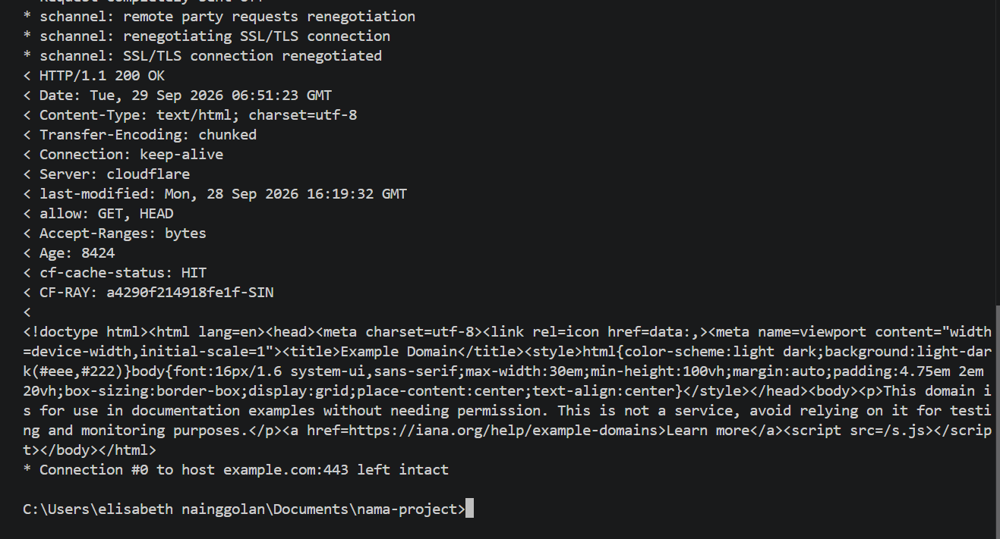

**Gambar 15.** Server menjawab `HTTP/1.1 200 OK` dengan header `Content-Type: text/html`, `Server: cloudflare`, `cf-cache-status: HIT` (berkas diambil dari cache Cloudflare), dan tanggal respons, lalu diikuti isi HTML halaman.

### 3.3 Analisis

**a) Perbedaan status dan ukuran antara pemuatan dengan dan tanpa cache.**

Ketika **Disable cache** dicentang, setiap berkas selalu diminta ulang ke server dan menjawab `200 OK` dengan ukuran respons penuh. Ketika cache **aktif**, berkas yang tidak berubah tidak diunduh ulang: peramban memakai salinan dari `disk cache` (ukuran muat hampir 0 karena tidak ada data yang lewat jaringan) atau memperoleh jawaban **`304 Not Modified`** dari server — status yang artinya "berkas tidak berubah sejak terakhir kali, pakai salinan di cache saja". Akibatnya halaman jauh lebih cepat dibuka karena hanya berkas yang benar-benar berubah yang diunduh.

**b) Alasan metode `curl -I` adalah HEAD.**

Opsi `-I` menyuruh curl memakai metode **HEAD**, bukan GET. Metode HEAD meminta server untuk mengirim **header respons saja tanpa badan (isi) halaman** — karena itu keluaran Gambar 12 dan 13 hanya berisi baris status dan deretan header, tidak ada HTML-nya. HEAD berguna untuk memeriksa apakah sebuah URL hidup, tipe kontennya, dan kebijakan cache-nya tanpa perlu mengunduh seluruh halaman.

**c) Alasan `http://github.com` dialihkan.**

Alamat `http://github.com` (versi tidak aman, tanpa enkripsi) dijawab server dengan **`301 Moved Permanently`** beserta header `Location: https://github.com/`. Artinya GitHub sengaja memindahkan seluruh lalu lintas HTTP ke HTTPS (versi aman berenkripsi TLS) secara permanen. Peramban secara otomatis mengikuti header `Location` itu sehingga pengguna tidak menyadarinya; curl tidak otomatis mengikuti pengalihan kecuali diberi opsi `-L`, sehingga status 301-nya tampak jelas.

> **Penjelasan singkat:** Satu permintaan HTTP sesungguhnya hanyalah teks biasa — satu baris permintaan (`METHOD path versi`), beberapa baris header, lalu badan respons. `curl -v` membuka "tirai" proses itu sehingga negosiasi DNS, TLS, dan isi percakapan peramban–server terlihat mentah. Kode status dibaca per ratusan: `2xx` sukses, `3xx` pengalihan, `4xx` salah di sisi klien, `5xx` salah di sisi server.

---

## 4. Kendala dan Penyelesaian

| No | Kendala | Penyelesaian |
|---|---|---|
| 1 | **Merge conflict** saat PR digabungkan karena `master` dan `penyelesaian-konflik` mengubah baris yang sama di README.md (GitHub menandai *"Can't automatically merge"*) | Konflik diselesaikan lewat editor VS Code: hapus penanda `<<<<<<<`, `=======`, `>>>>>>>`, pilih isi akhir (versi branch `penyelesaian-konflik`), simpan, lalu commit. Merge berhasil dengan 2 commits |
| 2 | Peringatan `LF will be replaced by CRLF` saat `git add` | Bukan error — hanya peringatan perbedaan format baris Windows (CRLF) vs Linux (LF). Git menanganinya otomatis, tidak perlu tindakan |
| 3 | Perintah `curl` di Windows PowerShell/CMD ternyata alias bawaan sistem, bukan aplikasi curl sungguhan | Gunakan `curl.exe` (misalnya `curl.exe -I ...`) agar memakai aplikasi curl yang benar dan keluarannya sesuai modul |
| 4 | Status `304 Not Modified` sempat membingungkan karena terlihat seperti "gagal" | Ternyata 304 adalah jawaban normal dari server ketika berkas belum berubah — justru menghemat kuota dan mempercepat pemuatan karena peramban memakai salinan cache |

---

## 5. Catatan Pemanfaatan AI

| Keterangan | Detail |
|---|---|
| **Alat** | Kimi (asisten AI dari Moonshot AI) |
| **Perintah utama** | "buatkan file dokumen teknis dalam bentuk .md dengan struktur [modul]" lalu "sesuaikan dengan format [kerangka modul]" |
| **Bagian yang digunakan** | membaca isi 15 tangkapan layar praktikum (lewat OCR) agar penjelasan sesuai bukti; menyusun ulang struktur dokumen sesuai format `modul-01.md`; merapikan bahasa dan membuat tabel lembar kerja HTTP (Tabel 9) |
| **Cara memverifikasinya** | Semua perintah Git/HTTP di dokumen ini dicocokkan kembali dengan tangkapan layar asli hasil praktikum; penjelasan konsep dicek ulang dengan materi modul. Tangkapan layar dan perintah di terminal dikerjakan sendiri, AI hanya membantu merapikan dokumentasi |

---


